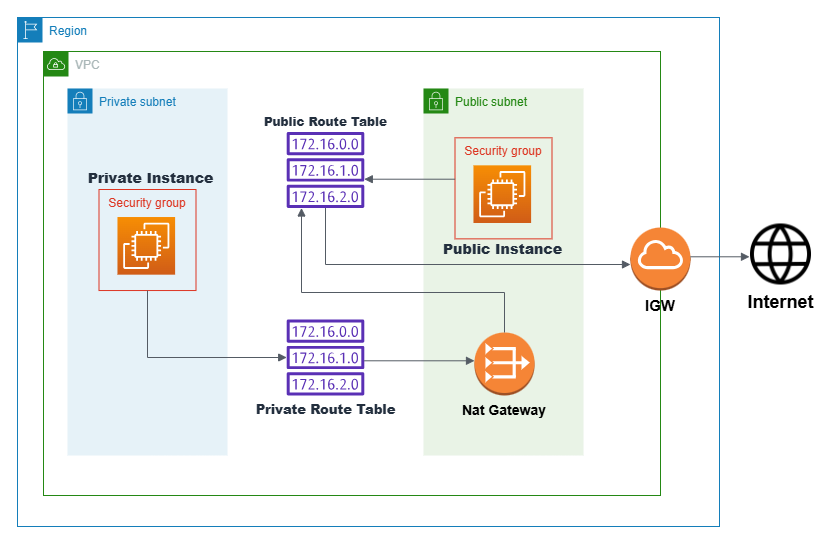

# AWS VPC Dual-Subnet Architecture with NAT Gateway

This project demonstrates how to build a secure and scalable **dual-subnet architecture on AWS** using **Amazon VPC**, where:
- The **public subnet** hosts an EC2 instance with internet access via an Internet Gateway (IGW)
- The **private subnet** securely accesses the internet via a **NAT Gateway**, but is not directly exposed

This setup is ideal for separating frontend (public-facing) and backend (internal/private) resources in cloud applications.

---

## Table of Contents

- [Architecture](#architecture)
- [Key Features](#key-features)
- [Step-by-Step Deployment](#step-by-step-deployment)
- [Testing & Validation](#testing--validation)
- [Project Structure](#project-structure)
- [Learnings](#learnings)
- [License](#license)

---

## Architecture


> Shared NACL, Security Group for both EC2s

---

## Key Features

- **Custom VPC** with CIDR `10.0.0.0/16`
- Public and private **subnets** across same AZ
- **Internet Gateway** for public access
- **NAT Gateway** for private outbound access
- Shared **Security Group** and **NACLs**
-  **RDP Access** to both EC2 instances (via bastion routing)

---

## Step-by-Step Deployment

1. **Create VPC** with CIDR `10.0.0.0/16`
2. **Attach IGW** to the VPC
3. **Create Subnets**:
   - `public-subnet` → `10.0.1.0/24`
   - `private-subnet` → `10.0.2.0/24`
4. **Create and Associate Route Tables**:
   - `public-route-table` → route to IGW
   - `private-route-table` → route to NAT Gateway
5. **Create NAT Gateway** in public subnet with Elastic IP
6. **Configure NACL**:
   - Inbound/Outbound → All Traffic (Rule #100) → Allow
   - Associate with both subnets
7. **Launch EC2 Instances**:
   - Public EC2: assign public IP, open RDP (3389), HTTP (80), HTTPS (443)
   - Private EC2: no public IP, same security group
8. **Connect** to private EC2 via public EC2 (bastion hop)
9. **Verify** private EC2 internet access via NAT

---

## Testing & Validation

| Test Description                             | Expected Result             |
|---------------------------------------------|-----------------------------|
| Access Public EC2 via RDP                    | Success                  |
| Public EC2 has direct internet access        | Yes                      |
| Connect Private EC2 from Public EC2 (RDP)    | Yes                      |
| Private EC2 has internet access (ping test)  | Works via NAT Gateway    |
| Private EC2 is NOT reachable from internet   | As intended              |

---

## Project Structure
```
aws-vpc-dual-subnet-nat/
├── architecture/
│ └── VPC.png
├── deployment/
│ ├── step-by-step-deployment.md 
│ └── test-cases.md 
├── LICENSE
└── README.md
```
---

## Learnings

- Built secure networking layers using VPC
- Understood use of NAT vs IGW
- Practiced subnet routing and NACL management
- Gained hands-on experience with AWS networking
- Used EC2 as a bastion to access internal systems

---